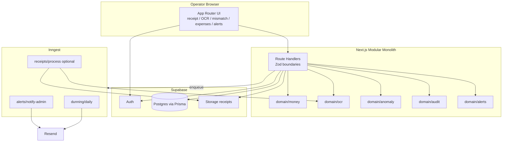

# Polykatoikia Design Document

> **Status:** Validated / locked — 2026-07-30  
> **Rationale:** Option B — simplified vertical slice (integrity kernel first)  
> **Scope:** Single management company, many buildings; integrity of money + OCR + anomaly + audit before multi-tenant or advanced ops

---

## 1. Problem

Greek apartment-building (πολυκατοικία) management companies track shared expenses, owner charges, and receipt evidence. Today that work is often spreadsheet-driven: amounts get mistyped, OCR suggestions are accepted without scrutiny, and unusual category spend goes unnoticed until owners complain.

**Polykatoikia v1** is an integrity-first operator tool that:

1. Stores all money as integer EUR cents (never float math).
2. Forces a written justification when an operator amount disagrees with OCR.
3. Flags expenses that exceed a trailing 12-month category average by a configurable margin.
4. Records every override and anomaly in an append-only audit trail and alert inbox.

v1 deliberately does **not** solve multi-company SaaS, owner self-serve portals, or full accounting exports. It proves the integrity kernel end-to-end for one management company.

---

## 2. Decisions

| Decision | Choice | Why |
|----------|--------|-----|
| Product slice | Option B — integrity kernel vertical slice | Ship money integrity, OCR mismatch, anomaly, audit before breadth |
| Tenancy | Single management company, many buildings | No `companyId` in v1; simpler RLS and seed data |
| App shape | Next.js App Router modular monolith (Approach A) | One deployable; clear domain modules without microservice overhead |
| Persistence | Prisma + Supabase Postgres | Typed schema, migrations, hosted Postgres |
| Files | Supabase Storage | Receipt images/PDFs alongside Auth |
| Auth | Supabase Auth; roles `ADMIN` \| `OPERATOR` \| `VIEWER` | Role gates for ack/resolve vs create vs read |
| Jobs | Inngest (not BullMQ) | Serverless-friendly, durable, idempotent functions |
| Email | Resend | Admin anomaly/dunning notifications |
| OCR | `OcrProvider` interface; default `mock`; optional `document_ai` \| `textract` via `OCR_PROVIDER` | Deterministic local/dev; real providers opt-in |
| Money | `Int` cents (EUR) everywhere | Eliminate float rounding bugs |
| Anomaly default | 3000 bps (30%) over trailing 12-mo avg per `(buildingId, categoryId)` | Conservative HIGH alert without noise tuning in v1 |
| UI | Data-dense dashboard; Fira Sans + Fira Code; `--primary #1E3A8A`; slate surfaces | Operator density over marketing polish |
| Locale | `el-GR` EUR formatting from cents | Greek operators; no emoji; Lucide icons |

---

## 3. Architecture



### Domain modules (Approach A)

| Module | Responsibility |
|--------|----------------|
| `src/domain/money` | Cents helpers, formatting (`el-GR`), share bps math; never float |
| `src/domain/ocr` | `OcrProvider` interface + mock / Document AI / Textract adapters |
| `src/domain/anomaly` | Trailing 12-mo average vs margin bps; produce HIGH alerts |
| `src/domain/audit` | Append-only `AuditLog` writers for create / override / ack |
| `src/domain/alerts` | Create, ack, resolve; enqueue admin notify |
| `src/domain/transactions` | Create EXPENSE / INCOME / CHARGE; mismatch gate; DB transaction wrapping Tx + Audit + Alert |
| `src/domain/dunning` | Notice generation rules consumed by Inngest daily job |

### AuthZ (v1)

| Role | Can |
|------|-----|
| `ADMIN` | Everything OPERATOR can + ack/resolve alerts + manage users/buildings (minimal admin surfaces) |
| `OPERATOR` | Upload receipts, create/edit draft transactions, supply mismatch justification, view buildings/expenses |
| `VIEWER` | Read-only buildings, transactions, alerts |

---

## 4. Schema outline

All monetary fields: `Int` (EUR cents). Shares: `shareBps` (`Int`, 0–10000 = 0%–100%).

```
User
  id, email, name, role (ADMIN|OPERATOR|VIEWER), createdAt, updatedAt
  ↔ Supabase Auth user id (same id or authUserId FK)

Building
  id, name, address, createdAt, updatedAt

Apartment
  id, buildingId, label, shareBps, createdAt, updatedAt

Owner
  id, name, email?, phone?, createdAt, updatedAt

ApartmentOwner
  id, apartmentId, ownerId, fromDate, toDate?

ExpenseCategory
  id, name, code?, createdAt, updatedAt

Transaction
  id, buildingId, apartmentId?, categoryId?
  type (EXPENSE|INCOME|CHARGE)
  amountCents Int
  description, occurredAt
  receiptId?, mismatchJustification?
  createdById, createdAt, updatedAt

Receipt
  id, buildingId, storagePath, mimeType
  ocrAmountCents Int?, ocrVendor?, ocrRaw Json?
  status (UPLOADED|PROCESSING|READY|FAILED)
  createdById, createdAt, updatedAt

AuditLog
  id, actorId, action, entityType, entityId
  payload Json, createdAt
  // actions include: TRANSACTION_CREATED, OCR_AMOUNT_OVERRIDE, ALERT_ACKED, ALERT_RESOLVED, …

Alert
  id, buildingId?, transactionId?, type (OCR_MISMATCH|ANOMALY|…)
  severity (HIGH|…), status (OPEN|ACKED|RESOLVED)
  title, body, createdAt, updatedAt, resolvedAt?, resolvedById?

DunningNotice
  id, buildingId, apartmentId?, ownerId?
  amountCents, dueDate, status, sentAt?, createdAt
```

### Integrity rules (enforced in domain + API)

1. **OCR mismatch:** If operator `amountCents ≠ receipt.ocrAmountCents` (when OCR amount present), require `mismatchJustification` with length ≥ 20. On accept: create `Alert` severity `HIGH`, type `OCR_MISMATCH`; write `AuditLog` action `OCR_AMOUNT_OVERRIDE`. Reject without justification.
2. **Anomaly:** Compare expense `amountCents` to trailing 12-month average for `(buildingId, categoryId)`. Flag if `amountCents > avg * (1 + marginBps/10000)`. Default `marginBps = 3000`. Create `Alert` HIGH + enqueue admin notify.
3. **Atomic write:** Creating a transaction that also emits audit/alert must run inside a single Prisma `$transaction`.

---

## 5. API

All handlers: Supabase session required; Zod request/response schemas at the boundary; money only as integers.

| Method | Path | Behavior |
|--------|------|----------|
| `POST` | `/api/receipts` | Multipart upload → Supabase Storage → OCR (sync mock or enqueue `receipts/process`) → draft `Receipt` READY with `ocrAmountCents` |
| `POST` | `/api/transactions` | Validate body; mismatch gate; anomaly check; `$transaction` insert Transaction + AuditLog + optional Alert(s); enqueue `alerts/notify-admin` when alerts created |
| `PATCH` | `/api/alerts/:id` | ADMIN only; ack or resolve; AuditLog |
| `GET` | `/api/buildings/:id/transactions` | List transactions for building (filters: type, category, date range); VIEWER+ |

### `POST /api/transactions` validation sketch

- `buildingId`, `type`, `amountCents` (positive Int), `occurredAt`, optional `categoryId`, `apartmentId`, `receiptId`, `description`, `mismatchJustification`
- If `receiptId` linked and OCR amount differs → justification ≥ 20 chars or `400`
- Response includes created `transaction`, any `alerts[]`, and whether anomaly fired

### Idempotency / jobs

- Inngest event IDs derived from stable keys (e.g. `alert:{alertId}:notify`, `dunning:{buildingId}:{date}`)
- Optional `receipts/process` keyed by `receipt:{receiptId}`

---

## 6. OCR

```ts
interface OcrProvider {
  extract(input: { storagePath: string; mimeType: string }): Promise<{
    amountCents: number | null;
    vendor: string | null;
    raw: unknown;
  }>;
}
```

| `OCR_PROVIDER` | Adapter |
|----------------|---------|
| `mock` (default) | Reads fixture or deterministic hash of path → fixed cents; offline CI-safe |
| `document_ai` | Google Document AI |
| `textract` | AWS Textract |

Factory selects provider from env. Domain never imports cloud SDKs directly outside adapters.

---

## 7. Jobs (Inngest)

| Function | Trigger | Behavior |
|----------|---------|----------|
| `dunning/daily` | Cron daily | Find overdue charges / unpaid CHARGE txs per building rules → create/update `DunningNotice` → Resend to owners when email present |
| `alerts/notify-admin` | Event on HIGH alert create | Email ADMIN users via Resend (anomaly + OCR mismatch) |
| `receipts/process` | Optional event after upload | Async OCR for slow providers; update Receipt status + ocr fields |

All functions: idempotent; use Inngest step boundaries for Storage / OCR / DB / Resend.

---

## 8. UI

**Tokens**

- `--primary: #1E3A8A`
- Surfaces: slate scale
- Danger: `#DC2626` (OCR mismatch)
- Warning: `#D97706` (anomaly)
- Fonts: Fira Sans (UI), Fira Code (amounts / IDs)
- Icons: Lucide only; no emoji
- Format money with `el-GR` from cents helpers

**Screens (operator vertical slice)**

1. **Receipt upload** — dropzone → POST `/api/receipts`
2. **OCR review** — show OCR amount vs editable operator amount
3. **Mismatch justification** — forced when amounts differ; ≥20 chars; danger styling
4. **Building expenses** — GET transactions table; anomaly/mismatch badges
5. **Alerts inbox** — list OPEN/ACKED; ADMIN ack/resolve via PATCH

Layout: data-dense dashboard shell (sidebar + main), not a marketing landing page.

---

## 9. Testing

| Layer | Coverage |
|-------|----------|
| Unit | Money helpers (add/format/reject float); mismatch gate (≥20 / reject); anomaly vs trailing avg + marginBps |
| Integration | Create transaction path: Transaction + AuditLog + Alert in one DB transaction; OCR_AMOUNT_OVERRIDE; anomaly alert |
| Fixtures | Mock OCR provider with known `ocrAmountCents`; receipt image fixtures for upload tests |
| API | Zod rejection cases; role gate on PATCH alerts |

Prefer Vitest (or project-default) + Prisma test DB / transactional rollback pattern.

---

## 10. Out of scope for v1

- Multi-tenant / multi-company (`companyId`, org switching)
- Owner self-serve portal / mobile apps
- Full double-entry ledger / tax filing / ΑΑΔΕ export
- Real-time chat, push notifications (email only via Resend)
- BullMQ / Redis workers
- Float or Decimal money columns
- Soft-delete everywhere / full GDPR export tooling
- Automated payment collection (Stripe etc.)
- Building-level custom anomaly margins UI (env/code default only)

---

## 11. Open risks

| Risk | Mitigation |
|------|------------|
| Trailing 12-mo avg cold start (few txs) | Skip anomaly or require N≥3 samples; document in anomaly module |
| Mock OCR ≠ production OCR quality | Keep provider interface; golden fixtures; staging with real provider before go-live |
| Supabase RLS vs Prisma service role | Decide: API uses service role + app-level AuthZ in v1; document RLS follow-up |
| Inngest local vs prod event delivery | Idempotency keys; dual-run safe notifies |
| Share bps not summing to 10000 | Validation warning on apartment set; not blocking expense create in v1 |
| Justification quality (garbage ≥20 chars) | Length gate only in v1; future: templates / review queue |
| Large receipt uploads | Storage size limits + mime allowlist (pdf/jpeg/png) |

---

## 12. Success criteria (vertical slice done)

- Operator can upload a receipt, review OCR, post an expense with or without mismatch justification.
- Mismatch without justification is rejected; with justification creates HIGH `OCR_MISMATCH` alert + `OCR_AMOUNT_OVERRIDE` audit.
- Expense above 30% over trailing average creates HIGH anomaly alert and admin email (Inngest + Resend).
- All amounts stored and computed as integer cents; UI shows `el-GR` EUR.
- Unit + integration tests green for money, mismatch, anomaly, and tx+audit+alert path.
