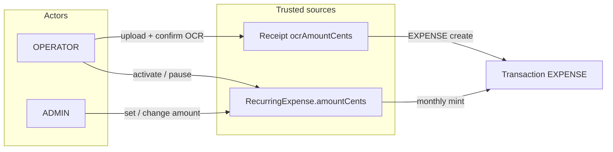

# Amount integrity — no operator-typed money

> **Status:** Validated / locked — 2026-08-05  
> **Rationale:** Operators must not type EUR amounts in daily flow; typos are the dominant integrity failure  
> **Supersedes (partial):** Design §4 OCR mismatch *override* path in `2026-07-30-polykatoikia-design.md` — justification override is retired for OPERATOR expense creation  
> **Scope:** Receipt-locked expenses + ADMIN-defined recurring πάγια; excludes extraordinary contributions without document (v2)

---

## 1. Problem

Operators currently can enter or edit `amountCents` when posting an expense (including after OCR). That reintroduces the spreadsheet failure mode Polykatikia was built to avoid.

**Goal:** Every expense `amountCents` comes from a trusted source the operator does not free-type in daily work.

---

## 2. Decisions

| Decision | Choice | Why |
|----------|--------|-----|
| Amount sources (v1) | (1) Receipt OCR (2) Recurring πάγιο template | Only two paths; no free amount field for OPERATOR |
| Wrong OCR | Re-upload / retry OCR — no amount override on expense create | Editing amount = typing money under another name |
| OCR field correction | Not in OPERATOR UI in v1; optional ADMIN OCR correction later | Keeps “confirm document” vs “edit cents” separate |
| Mismatch justification path | Disabled for receipt-linked EXPENSE create | Amount must equal `ocrAmountCents` |
| Πάγια amount setup | **ADMIN only** | Contract amounts are config, not daily ops |
| OPERATOR on πάγια | Activate / pause only | Can run month without typing |
| Expenses without receipt or πάγιο | Out of scope v1 (έκτακτη εισφορά → v2 ADMIN path) | YAGNI until πάγια + OCR-locked ship |
| Real OCR providers | Still mock default; Document AI / Textract later | Integrity rules independent of provider quality |

---

## 3. Amount sources

---

## 4. Flow A — Receipt expense (OCR-locked)

1. OPERATOR uploads receipt → OCR runs → `Receipt` READY with `ocrAmountCents`.
2. Review UI shows image + OCR amount / vendor / date.
3. Actions: **Σωστό** (confirm) or **Λάθος OCR** (retry / re-upload).
4. On confirm: create EXPENSE with `amountCents = ocrAmountCents` (server enforces equality). No editable amount field. No justify route for amount mismatch.
5. Category (+ optional description) still chosen by OPERATOR.

**Server rule:** If `receiptId` present, reject create unless `amountCents === receipt.ocrAmountCents` (and OCR linkable as today). Do not accept `mismatchJustification` as a bypass for EXPENSE+receipt.

**UI:** Remove operator amount input from review → create path; remove / deprecate justify-for-mismatch amount flow for this path.

---

## 5. Flow B — Recurring πάγια

### Model (conceptual)

`RecurringExpense`:

| Field | Notes |
|-------|--------|
| `id`, `buildingId`, `categoryId` | Required |
| `amountCents` | Positive Int; ADMIN write |
| `dayOfMonth` | 1–28 (avoid month-end edge) or fixed “on period open” |
| `label` / `description` | e.g. «Κηπουρός» |
| `active` | Boolean; OPERATOR may toggle |
| `createdById`, timestamps | Audit |

Unique-ish constraint: one active template per `(buildingId, categoryId, label)` or simply list many and dedupe mint by `sourceRecurringId` + period.

### Roles

| Action | ADMIN | OPERATOR | VIEWER |
|--------|-------|----------|--------|
| Create / edit amount / delete | ✓ | ✗ | ✗ |
| Activate / pause (`active`) | ✓ | ✓ | ✗ |
| List | ✓ | ✓ | ✓ |

### Monthly mint

When period expenses are collected (preview/finalize κοινόχρηστα, or dedicated job):

- For each `active` template on the building, if no EXPENSE yet for that period linked to the template → create EXPENSE with `amountCents` from template, `categoryId` from template, no receipt (or flag `source = RECURRING`).
- Idempotent: never double-mint for same `(recurringExpenseId, year, month)`.

Examples: κηπουρός, θυρωρός, διαχείριση, μηνιαία συντήρηση ασανσέρ.

---

## 6. Out of scope (v2)

- Έκτακτη εισφορά / αποθεματικό χωρίς παραστατικό (ADMIN decision path).
- ADMIN inline OCR amount correction UI (may add with audit later).
- Production Document AI / Textract.
- PSP / auto-pay.

---

## 7. Impact on existing design

| Prior rule | New rule |
|------------|----------|
| Operator may set amount ≠ OCR with justification ≥ 20 | Receipt EXPENSE amount **must** equal OCR; no justification bypass |
| `OCR_MISMATCH` / `OCR_AMOUNT_OVERRIDE` on create | Not created for normal receipt EXPENSE path (path removed) |
| Free EXPENSE without receipt | Still possible only via πάγιο mint in v1; ad-hoc no-receipt EXPENSE not for OPERATOR daily UI |

Keep: cents-only money, anomaly on category spend, audit on create, receipt upload + OCR READY gate.

---

## 8. Acceptance criteria

1. OPERATOR cannot submit a receipt-linked EXPENSE with an amount different from OCR (API 400; UI has no amount field).
2. Confirming a correct OCR creates EXPENSE with `amountCents === ocrAmountCents`.
3. Wrong OCR path does not offer amount typing — only retry / re-upload.
4. ADMIN can create a πάγιο with amount; OPERATOR cannot change that amount.
5. OPERATOR can pause/activate a πάγιο.
6. Active πάγιο mints exactly one EXPENSE per building period (idempotent).
7. Existing unit tests for money/OCR still pass; mismatch-override tests updated or removed to match new policy.

---

## 9. Open implementation notes

- Prefer linking minted recurring expenses via nullable `recurringExpenseId` on `Transaction` (or settlement-period uniqueness table) for idempotency.
- Seed: at least one πάγιο (e.g. κηπουρός) on demo building + ADMIN user for setup demos.
- Nav: building «Πάγια» page or section under shares/expenses.
